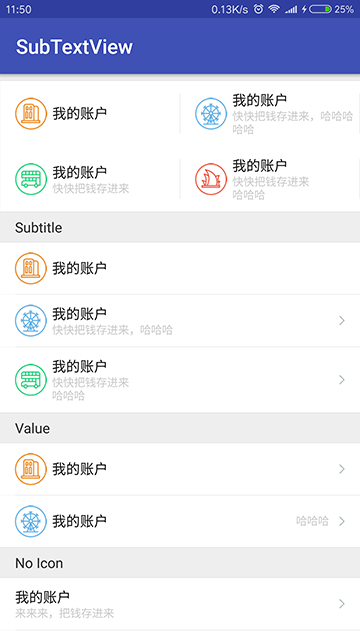

# SubTextView
 
[](https://jitpack.io/#czy1121/subtextview)
 
带补充文本(副标题，值)的 TextView 

 


## Gradle

``` groovy
repositories { 
    maven { url "https://jitpack.io" }
}
```  
    
``` groovy
dependencies {
    compile 'com.github.czy1121:subtextview:1.0.0'
}
```
    
## Usage
    
**XML**

``` xml
<com.github.czy1121.view.SubTextView
    style="@style/CellTextView.Subtitle"
    android:drawableLeft="@mipmap/list_3"
    android:drawableRight="@mipmap/next"
    android:text="我的账户"
    app:stvSubText="快把钱存进来\n哈哈哈"/>

<com.github.czy1121.view.SubTextView
    style="@style/CellTextView.Value"
    android:drawableLeft="@mipmap/list_2"
    android:text="我的账户"
    app:stvSubText="哈哈哈"/>
``` 

**属性**

``` xml 
<declare-styleable name="SubTextView">
    <attr name="stvSubText" format="string"/>
    <attr name="stvSubTextSize" format="dimension"/>
    <attr name="stvSubTextColor" format="color"/>
    <!-- 主文本与副文本间的间隙 -->
    <attr name="stvSubTextGap" format="dimension"/>
    <!-- 副文本作为副标题或值 -->
    <attr name="stvSubTextMode">
        <enum name="subtitle" value="0"/>
        <enum name="value" value="1"/>
    </attr> 
</declare-styleable>
```
 

## License

```
Copyright 2016 czy1121

Licensed under the Apache License, Version 2.0 (the "License");
you may not use this file except in compliance with the License.
You may obtain a copy of the License at

   http://www.apache.org/licenses/LICENSE-2.0

Unless required by applicable law or agreed to in writing, software
distributed under the License is distributed on an "AS IS" BASIS,
WITHOUT WARRANTIES OR CONDITIONS OF ANY KIND, either express or implied.
See the License for the specific language governing permissions and
limitations under the License.
```